# LINUX UBUNTU 20.04 LAMP/LEMP DEV SERVER


## Passo a Passo: Configurando um ambiente de desenvolvimento [LAMP](https://en.wikipedia.org/wiki/LAMP_%28software_bundle%29)/[LEMP](https://lemp.io/) no Ubuntu 20.04:


- MYSQL8.0 [🔗](#mysql-80)
- MYSQL5.7 [🔗](#mysql-57)
- PHP7.4 [🔗](#php-74)
- PHP8.0 [🔗](#php-80)
- APACHE [🔗](#apache)
- NGINX [🔗](#nginx)
- XDEBUG [🔗](#xdebug)
- VSCODE [🔗](#vscode)
- lampconfig.sh (Orquestrador) [🔗](#lampconfigsh)
- Configuração de novo domínio [🔗](#criando-um-novo-domínio-testedevbr)


&nbsp;<br />
# INTRODUÇÃO


&nbsp;<br />
Após seguir as instruções, será possível mudar o stack de desenvolvimento com apenas um comando, como neste exemplo:
```sh
sudo ~/lampconfig.sh "nginx php7.4 mysql5.7 xdebugon"
```
Ou ainda:
```sh
sudo ~/lampconfig.sh "apache php8 mysql8 xdebugoff"
```
Diferente das soluções baseadas em container, aqui, as aplicações são instaladas de forma nativa. O controle é feito pelo script **lampconfig.sh**.

Um problema bastante comum para o desenvolvedor que adota Linux, é a ausência de um ambiente integrado e flexível de desenvolvimento LAMP/LEMP que permita testar sua aplicação em diferentes versões de configuração. Até o momento, não existe um similar do [Laragon](https://laragon.org/) para Linux. Esta foi a necessidade que levou ao desenvolvimento desta solução e a criação deste manual.

Existem vários tutoriais de configuração LAMP na internet. O que este tem de diferente?
**Nenhum mostra como fazer a configuração de fim a fim. Nenhum mostra como montar uma solução que permita trocar diferentes versões de stack**. Esta foi a motivação para criar este artigo. O mesmo é o resultado da combinação de dezenas de sites e alguns dias de tentativas, erros e desenvolvimento próprio.

Vamos supor que você possui um site Wordpress em produção e precisa testar sua compatibilidade com uma nova versão de Webserver ou Database antes de atualizar o servidor. É inviável criar uma máquina virtual para cada combinação possível. Por este motivo é que a capacidade de trocar diferentes versões de stack é importante.

Após seguir os passos aqui descritos, você terá um ambiente de desenvolvimento com as seguintes características:

- NGINX/APACHE, PHP7.4/PHP8.0, MYSQL5.7/MYSQL8.0. Instalação original, sem container.
- Combinação entre quaisquer das 8 possibilidades de WEBSERVER, PHP e MYSQL
- HTTPS
- XDEBUG integrado ao VSCODE

Setup utilizado: [VirtualBox](https://www.virtualbox.org/), [Xubuntu 20.04](https://xubuntu.org/) com a seguinte configuração: 4G Ram, 20G SSD e 2 CPUs.


&nbsp;<br />
# MYSQL 8.0


&nbsp;<br />
No caso do Linux, existem 2 modos de instalar mais de uma versão de MYSQL em uma mesma máquina:

1. Conteinizar a instalação usando [Docker](https://en.wikipedia.org/wiki/Docker_(software))
2. Instalar a partir do código fonte, indicando a pasta desejada em cada compilação.

&nbsp;<br />
Aqui, vamos usar a **segunda opção**, começando a instalação pelo MYSQL8.0, que é o passo mais 'pesado' de todos e que gera a maior quantidade de arquivos temporários (8GB).

IMPORTANTE! Instale o MYSQL8.0 antes do MYSQL5.7 pois alguns comandos de inicialização (Ex. Criação de usuário) e finalização (Ex. Remoção de temporários) dependem desta sequência.


&nbsp;<br />
## Compilando o MYSQL 8.0


&nbsp;<br />
Instale os pacotes necessários para a compilação:

```sh
sudo apt install cmake build-essential openssl libssl-dev libncurses5-dev bison
```

&nbsp;<br />
Crie o usuário e grupo mysql:

```sh
sudo groupadd mysql && sudo useradd -r -g mysql -s /bin/false mysql
```

&nbsp;<br />
Crie a pasta onde os fontes serão descompactados

```sh
mkdir ~/Documents/mysql8-sources && cd ~/Documents/mysql8-sources
```

&nbsp;<br />
Baixe o código fonte:

```sh
wget https://dev.mysql.com/get/Downloads/MySQL-8.0/mysql-8.0.34.tar.gz
```

&nbsp;<br />
Descompacte os fontes e crie a pasta que receberá os arquivos do build

```sh
tar zxvf mysql-8.0.34.tar.gz && cd mysql-8.0.34 && mkdir bld && cd bld
```

&nbsp;<br />
Prepare a compilação. A pasta de instalação default do MYSQL é a /usr/local/mysql. Aqui, vamos alterar essa pasta para /usr/local/mysql8.0 permitindo assim que outras versões sejam instaladas.
```sh
sudo cmake .. -DCMAKE_INSTALL_PREFIX=/usr/local/mysql8.0 -DDOWNLOAD_BOOST=1 -DWITH_BOOST=$HOME/my_boost
```
Obs: Diferente de uma instalação convencional via apt que cria arquivos em diversas pastas (/etc, /var, /usr). A instalação por código fonte direciona todos os arquivos para um só lugar. Executáveis, Dados, Configuração, etc. Tudo ficará na pasta /usr/local/mysql8.0

&nbsp;<br />
Compile os fontes.
```sh
sudo make
```
Obs: Esse processamento leva cerca de meia hora. Você irá ver algumas mensagens coloridas passando pela sua tela..

&nbsp;<br />
Instale:
```sh
sudo make install
```


&nbsp;<br />
## Configurando o MYSQL 8.0


&nbsp;<br />
Vá para a pasta de instalação e crie a sub-pasta que receberá os arquivos de dados criados na inicialização.
```sh
cd /usr/local/mysql8.0 && sudo mkdir mysql-files && sudo chown mysql:mysql mysql-files && sudo chmod 750 mysql-files
```

&nbsp;<br />
Inicialize os arquivos de dados
```sh
sudo /usr/local/mysql8.0/bin/mysqld --initialize --user=mysql
```

**Importante!** durante a inicialização, será gerada uma senha temporária para o usuário root@localhost. **ANOTE ESTA SENHA**.

A mensagem com a senha é parecida com esta: `[Server] A temporary password is generated for root@localhost: SW/Oitry6vx<`

&nbsp;<br />
Configure a conexão segura. (Ignore o Warning).
```sh
sudo /usr/local/mysql8.0/bin/mysql_ssl_rsa_setup
```

&nbsp;<br />
Inicie o serviço manualmente para verificar se tudo está em ordem:
```sh
sudo /usr/local/mysql8.0/bin/mysqld_safe --user=mysql &
```
Obs: o **&** no final do comando serve para o processo rodar em background não travar o terminal.

&nbsp;<br />
Faça seu primeiro login. Usando como exemplo, a senha recebida acima, perceba que o caractere '**/**' está precedido por '**\\**'. Troque esta senha pela que você anotou na etapa anterior.
```sh
/usr/local/mysql8.0/bin/mysql -uroot -pSW\/Oitry6vx\\<
```

&nbsp;<br />
Uma vez logado no mysql, altere para uma senha de sua preferência. Como este é um servidor de desenvolvimento, vamos usar '1234'.
```sh
ALTER USER 'root'@'localhost' IDENTIFIED WITH mysql_native_password BY '1234';
exit
```

&nbsp;<br />
Refaça o login para testar a sua nova senha:
```sh
/usr/local/mysql8.0/bin/mysql -uroot -p1234
```
```sh
exit
```

&nbsp;<br />
O MYSQL subiu com as configurações default. Para customizar seu funcionamento, precisamos criar um arquivo de configuração:
```sh
cd /usr/local/mysql8.0 && sudo touch my.cnf && sudo chmod 644 my.cnf && sudo editor /usr/local/mysql8.0/my.cnf
```

&nbsp;<br />
Uma vez que o arquivo estiver aberto no editor de textos, insira algumas configurações, por exemplo, as linhas abaixo:
```
[mysqld]
collation-server = utf8_general_ci
character-set-server = utf8
```

&nbsp;<br />
Vamos copiar o script de controle para a pasta **/etc/init.d/**. Isso é necessário para que você possa iniciar e parar o banco de dados de uma forma padronizada, via **systemctl**.
```sh
sudo cp /usr/local/mysql8.0/support-files/mysql.server /etc/init.d/mysql8.0 && sudo chmod +x /etc/init.d/mysql8.0
```

&nbsp;<br />
Reinicie o banco de dados e verifique seu status, executando diretamente o script instalado:
```sh
sudo sh /etc/init.d/mysql8.0 restart && sudo sh /etc/init.d/mysql8.0 status
```

&nbsp;<br />
Faça o systemctl reconhecer o novo serviço instalado:
```sh
sudo systemctl daemon-reload
```

&nbsp;<br />
Agora reinicie o banco de dados usando o systemctl:
```sh
sudo systemctl restart mysql8.0.service && sudo systemctl status mysql8.0.service
```


&nbsp;<br />
## Limpando arquivos temporários MYSQL 8.0


&nbsp;<br />
Caso não tenha ocorrido nenhum erro, seu banco de dados foi instalado com sucesso. Os fontes e o pacote de testes podem ser opcionalmente apagados com estes dois comandos:
```sh
sudo rm -R ~/Documents/mysql8-sources
```
```sh
sudo rm -R /usr/local/mysql8.0/mysql-test
```

Obs: Diferente do MYSQL5.7, a pasta /usr/local/mysql8.0/lib não pode ser removida:

&nbsp;<br />
Pare o banco de dados para evitar conflito com a próxima instalação:
```sh
sudo systemctl stop mysql8.0.service
```


&nbsp;<br />
# MYSQL 5.7


&nbsp;<br />
Para o MYSQL5.7, o processo é bem parecido.

Os pacotes necessários para a compilação já foram instalados no passo anterior.

O usuário e grupo **mysql** também já foram criados no passo anterior.


&nbsp;<br />
## Compilando o MYSQL 5.7


&nbsp;<br />
Crie a pasta onde os fontes serão descompactados:
```sh
mkdir ~/Documents/mysql5-sources && cd ~/Documents/mysql5-sources
```

&nbsp;<br />
Baixe os fontes:
```sh
wget https://dev.mysql.com/get/Downloads/MySQL-5.7/mysql-5.7.43.tar.gz
```

&nbsp;<br />
Descompacte os fontes e crie a pasta que receberá o build:
```sh
tar zxvf mysql-5.7.43.tar.gz && cd mysql-5.7.43 && mkdir bld && cd bld
```
&nbsp;<br />
Prepare a compilação.
```sh
sudo cmake .. -DCMAKE_INSTALL_PREFIX=/usr/local/mysql5.7 -DDOWNLOAD_BOOST=1 -DWITH_BOOST=$HOME/my_boost
```

&nbsp;<br />
Compile os fontes:
```sh
sudo make
```
Obs: Esse processamento leva cerca de meia hora.

&nbsp;<br />
Instale:
```sh
sudo make install
```

&nbsp;<br />
## Configurando o MYSQL 5.7


&nbsp;<br />
Vá para a pasta de instalação e crie a sub-pasta onde ficarão os arquivos de dados
```sh
cd /usr/local/mysql5.7 && sudo mkdir mysql-files && sudo chown mysql:mysql mysql-files && sudo chmod 750 mysql-files
```

&nbsp;<br />
Inicialize os arquivos de dados
```sh
sudo /usr/local/mysql5.7/bin/mysqld --initialize --user=mysql
```

IMPORTANTE! Durante a inicialização, será gerada uma senha temporária para o usuário root@localhost. **ANOTE ESTA SENHA**.
Caso esta senha contenha caracteres especiais, eles devem ser escapados com '\\' quando for utilizada para logar no client.
Exemplo de mensagem:

`[Server] A temporary password is generated for root@localhost: SW/Oitry6vx<`

&nbsp;<br />
Configure a conexão segura.
```sh
sudo /usr/local/mysql5.7/bin/mysql_ssl_rsa_setup
```
Ignore a mensagem de warning.

&nbsp;<br />
Inicie o serviço manualmente para verificar se tudo está em ordem:
```sh
sudo /usr/local/mysql5.7/bin/mysqld_safe --user=mysql &
```

&nbsp;<br />
Faça seu primeiro login. Caso a senha recebida não funcione, insira '\\' antes dos caracteres especiais. Substitua *GeneratedTemporaryPassword* pela senha que recebeu durante o processo de inicialização do banco.
```sh
/usr/local/mysql5.7/bin/mysql -uroot -pGeneratedTemporaryPassword
```

Caso o login tenha sido bem sucedido, será apresentada uma mensagem como esta:

```
mysql: [Warning] Using a password on the command line interface can be insecure.

Welcome to the MySQL monitor.  Commands end with ; or \g.
Your MySQL connection id is 2
Server version: 5.7.43
Copyright (c) 2000, 2023, Oracle and/or its affiliates.
Oracle is a registered trademark of Oracle Corporation and/or its
affiliates. Other names may be trademarks of their respective
owners.
Type 'help;' or '\h' for help. Type '\c' to clear the current input statement.
mysql>
```

&nbsp;<br />
Uma vez logado no mysql, altere para uma senha de sua preferência. Como este é um servidor de desenvolvimento, uma senha '1234' não será problema.
```sh
ALTER USER 'root'@'localhost' IDENTIFIED WITH mysql_native_password BY '1234';
exit
```

&nbsp;<br />
Refaça o login para testar a sua nova senha:
```sh
/usr/local/mysql5.7/bin/mysql -uroot -p1234
```
```sh
exit
```

&nbsp;<br />
O MYSQL subiu com as configurações default. Para customizar seu funcionamento, precisamos criar um arquivo de configuração:
```sh
cd /usr/local/mysql5.7 && sudo touch my.cnf && sudo chmod 644 my.cnf && sudo editor /usr/local/mysql5.7/my.cnf
```

&nbsp;<br />
Insira algumas configurações, por exemplo, estas linhas abaixo:

```
[mysqld]
collation-server = utf8_general_ci
character-set-server = utf8
```

&nbsp;<br />
Registre o script de controle. Isso é necessário para que você possa iniciar e parar o banco de dados de uma forma padronizada.
```sh
sudo cp /usr/local/mysql5.7/support-files/mysql.server /etc/init.d/mysql5.7 && sudo chmod +x /etc/init.d/mysql5.7
```

&nbsp;<br />
Faça o systemctl reconhecer o novo serviço instalado:
```sh
sudo systemctl daemon-reload
```

&nbsp;<br />
Agora reinicie o banco de dados usando o systemctl:
```sh
sudo systemctl restart mysql5.7.service
```

&nbsp;<br />
Pare o banco de dados:
```sh
sudo systemctl stop mysql5.7.service
```


&nbsp;<br />
## Limpando os arquivos temorários MYSQL 5.7


&nbsp;<br />
Agora podemos apagar as bibliotecas usadas na compilação, códigos-fonte e demais arquivos desnecessários. Isto irá liberar ~10GB de espaço em disco:
```sh
sudo rm -R ~/Documents/mysql5-sources
sudo rm -R ~/my_boost
sudo rm -R /usr/local/mysql5.7/mysql-test
sudo rm -R /usr/local/mysql5.7/lib
sudo rm /usr/local/mysql5.7/bin/mysql*embedded
```

&nbsp;<br />
Agora sua máquina possui duas versões de MYSQL. Nunca starte ambas simultâneamente, pois haverá conflito de porta (3306) e socket (/tmp/mysql.sock). <br>
Lembrando que o controle da versão irá subir será feito pelo script **lampconfig.sh**, apresentado adiante.


&nbsp;<br />
# PHP 7.4


&nbsp;<br />
Diferente do MYSQL, o PHP já vem preparado para ser instalado em pastas separadas de acordo com a versão.

Para que o APACHE e o NGINX possam compartilhar a mesma instância de PHP, este precisará ser instalado como FPM. Desta forma o PHP roda como um processo independente.


&nbsp;<br />
## Instalando o PHP 7.4


&nbsp;<br />
Instale os pacotes básicos:
```sh
sudo apt install php7.4-fpm php7.4-mysql php7.4-gd php7.4-xml php7.4-mbstring
```

&nbsp;<br />
Verifique o status do serviço
```sh
systemctl status php7.4-fpm.service
```

&nbsp;<br />
Caso o serviço esteja OK, você deverá ver uma mensagem assim:
```
● php7.4-fpm.service - The PHP 7.4 FastCGI Process Manager
     Loaded: loaded (/lib/systemd/system/php7.4-fpm.service; enabled; vendor preset: enabled)
     Active: active (running) since Fri 2023-08-25 16:36:33 -03; 23s ago
       Docs: man:php-fpm7.4(8)
    Process: 70990 ExecStartPost=/usr/lib/php/php-fpm-socket-helper install /run/php/php-fpm.sock /etc/php/7.4/fpm/pool.d/www.conf 74 (c>
   Main PID: 70974 (php-fpm7.4)
     Status: "Processes active: 0, idle: 2, Requests: 0, slow: 0, Traffic: 0req/sec"
      Tasks: 3 (limit: 4631)
     Memory: 8.1M
     CGroup: /system.slice/php7.4-fpm.service
             ├─70974 php-fpm: master process (/etc/php/7.4/fpm/php-fpm.conf)
             ├─70988 php-fpm: pool www
             └─70989 php-fpm: pool www
```


&nbsp;<br />
## Configurando o PHP 7.4

&nbsp;<br />
Copie o texto abaixo, cole no shell e tecle ENTER para aplicar os novos valores em alguns parâmetros do serviço PHP.

```sh
# Arquivo a ser modificado
phpIni=/etc/php/7.4/fpm/php.ini

if [ -e "$phpIni" ]; then

	# Parametros e seus novos valores
	novosParametros=(
		'max_execution_time             3600'
		'max_input_vars                 10000'
		'memory_limit                   256M'
		'display_errors                 On'
		'display_startup_errors         On'
		'post_max_size                  128M'
		'upload_max_filesize            128M'
		'pdo_mysql.default_socket       \/tmp\/mysql.sock'
		'mysqli.default_socket          \/tmp\/mysql.sock'
		'opcache\.enable                1'
		'opcache\.validate_timestamps   1'
		'opcache\.revalidate_freq       2'
	)

	# Aplica as modificações
	for parametro in "${novosParametros[@]}"; do
		cmd="sudo sed -i -E 's/^.{0,2}(${parametro% *} ?=).{0,10}$/\1 ${parametro#* }/' $phpIni"
		echo $cmd; eval $cmd
	done

	# Apresenta as linhas modificadas para conferência
	echo
	echo "CONFIRA AS ALTERAÇÕES:"
	grep -Ens '.*(max_execution_time|max_input_vars|memory_limit|display_errors|display_startup_errors|post_max_size|upload_max_filesize|default_socket|opcache.enable|validate_timestamps|revalidate_freq) *=' $phpIni
else
	echo "ARQUIVO INEXISTENTE!"
fi
```

```sh
# Observações:
# O caractere '/' é um delimitador de comando no sed, então ele deve ser precedido por '\' quando usado de forma literal, por isso "\/tmp\/mysql.sock"
# -Ens: (E)xtended Regex    Line (n)umber    (s)uppress error msgs
```

### Caso deseje alterar a quantidade de instâncias

Edite o arquivo de configuração

```sh
sudo editor /etc/php/7.0/fpm/pool.d/www.conf
```

Edite os parametros abaixo para modificar a quantidade de instâncias, por exemplo:

```sh
pm.max_children = 10
pm.start_servers = 3
pm.min_spare_servers = 2
pm.max_spare_servers = 4
```


&nbsp;<br />
Reinicie e verifique o status do serviço
```sh
sudo systemctl restart php7.4-fpm.service && systemctl status php7.4-fpm.service
```

&nbsp;<br />
Tudo certo, podemos parar e desabilitar o serviço
```sh
sudo systemctl disable --now php7.4-fpm.service
```


&nbsp;<br />
# PHP 8.0


&nbsp;<br />
## Configurando um novo PPA


&nbsp;<br />
Prepare a adição de um novo PPA (Personal Package Archive). PPAs permitem a instalação de softwares de repositórios alternativos.
```sh
sudo apt install software-properties-common
```
```sh
sudo add-apt-repository ppa:ondrej/php
```
Obs: O segundo comando retornará uma longa mensagem com alguns avisos. Apenas tecle [ENTER] para prosseguir.


&nbsp;<br />
## Instalando o PHP 8.0


&nbsp;<br />
Instale os pacotes:
```sh
sudo apt install php8.0-fpm php8.0-mysql php8.0-gd php8.0-xml php8.0-mbstring
```

&nbsp;<br />
Verifique o status do serviço
```sh
systemctl status php8.0-fpm.service
```

&nbsp;<br />
Caso o serviço esteja OK, você deverá ver uma mensagem assim:
```
● php8.0-fpm.service - The PHP 8.0 FastCGI Process Manager
     Loaded: loaded (/lib/systemd/system/php8.0-fpm.service; enabled; vendor preset: enabled)
     Active: active (running) since Fri 2023-08-25 17:15:03 -03; 39s ago
       Docs: man:php-fpm8.0(8)
    Process: 91502 ExecStartPost=/usr/lib/php/php-fpm-socket-helper install /run/php/php-fpm.sock /etc/php/8.0/fpm/pool.d/www.conf 80 (code=exited,>
   Main PID: 91490 (php-fpm8.0)
     Status: "Processes active: 0, idle: 2, Requests: 0, slow: 0, Traffic: 0req/sec"
      Tasks: 3 (limit: 4631)
     Memory: 8.5M
     CGroup: /system.slice/php8.0-fpm.service
             ├─91490 php-fpm: master process (/etc/php/8.0/fpm/php-fpm.conf)
             ├─91500 php-fpm: pool www
             └─91501 php-fpm: pool www
```


&nbsp;<br />
## Configurando o PHP 8.0


&nbsp;<br />
O processo é análogo ao usado no PHP 7.4

Execute o [mesmo script usado na configuração do PHP 7.4](#configurando-o-php-74) . Apenas altere: `phpIni=/etc/php/8.0/fpm/php.ini`


&nbsp;<br />
Reinicie e verifique o status do serviço
```sh
sudo systemctl restart php8.0-fpm.service && systemctl status php8.0-fpm.service
```

&nbsp;<br />
Verifique qual a versao esta ativa:
```sh
php -v
```

&nbsp;<br />
Para chavear entre as versoes do PHP, use estes comandos:
```sh
sudo update-alternatives --set php /usr/bin/php7.4
```
```sh
sudo update-alternatives --set php /usr/bin/php8.0
```

&nbsp;<br />
Tudo certo, podemos parar e desabilitar o serviço
```sh
sudo systemctl disable --now php8.0-fpm.service
```


&nbsp;<br />
# APACHE


&nbsp;<br />
## Instalando o Apache


&nbsp;<br />
Instale o Apache:
```sh
sudo apt install apache2 libapache2-mod-fcgid
```

&nbsp;<br />
Instale o curl:
```sh
sudo apt install curl
```

&nbsp;<br />
Teste a instalação:
```sh
curl -s -I localhost
```
O comando acima deverá retornar uma mensagem assim

```
HTTP/1.1 200 OK
Date: Fri, 25 Aug 2023 20:34:19 GMT
Server: Apache/2.4.41 (Ubuntu)
Last-Modified: Fri, 25 Aug 2023 20:32:02 GMT
ETag: "2aa6-603c53cbaca3c"
Accept-Ranges: bytes
Content-Length: 10918
Vary: Accept-Encoding
Content-Type: text/html
```


&nbsp;<br />
## Configurando o Apache


&nbsp;<br />
Mude a pasta de publicação de /var/www/ para ~/public_html/. Isto e necessário para que você possa editar suas aplicações pelo VSCODE sem precisar de **sudo**.
```sh
sudo editor /etc/apache2/apache2.conf
```

Linha 170: Edite a diretiva que começa com `<Directory \/var\/www...>` e faça ela ficar assim:
```
<Directory /home/ma/public_html/>
        Options Indexes FollowSymLinks
        AllowOverride None
        Require all granted
        DirectoryIndex index.php index.html
</Directory>
```
**IMPORTANTE!**: Não esqueça de trocar **ma** pelo seu usuário!

Obs: A diretiva **DirectoryIndex** é necessária para que index.php seja reconhecido

&nbsp;<br />
Ou se preferir, apenas execute os comandos abaixo para efetuar as alterações necessárias:

```sh
sudo sed -i -E '/(<Directory .var.www.?>)/a \\tDirectoryIndex index.html index.php' /etc/apache2/apache2.conf
```
```sh
sudo sed -i -E 's/(<Directory .var.www.?>)/<Directory \/home\/ma\/public_html\/>/' /etc/apache2/apache2.conf
```
Verifica se as alteracoes foram feitas:
```sh
grep -wns '\/home\/ma\/public_html' /etc/apache2/apache2.conf -A 5
```
Obs: O Comando acima mostra 5 linhas apos a linha do regex

&nbsp;<br />
Crie as páginas web usadas nos testes
```sh
mkdir ~/public_html && mkdir ~/public_html/localhost/
```

```sh
cp /var/www/html/index.html ~/public_html/localhost/
```

```sh
mkdir ~/public_html/localhost/phpinfo
```

```sh
echo '<?php phpinfo(); ?>' > ~/public_html/localhost/phpinfo/index.php
```

```sh
sudo chmod +x /home/ma
```


&nbsp;<br />
Crie os arquivos de configuração para o dominio localhost
```sh
sudo editor /etc/apache2/sites-available/localhost.conf
```

&nbsp;<br />
Adicione este conteúdo ao arquivo e salve-o:
```
<VirtualHost 127.0.0.1:80>
	ServerName localhost
	DocumentRoot /home/ma/public_html/localhost
	ServerAdmin webmaster@localhost
	ErrorLog ${APACHE_LOG_DIR}/error.log
	CustomLog ${APACHE_LOG_DIR}/access.log combined
</VirtualHost>
```
**IMPORTANTE!**: Não esqueça de trocar **ma** pelo seu usuário!

&nbsp;<br />
Habilite o site criando um symbolic link para para o arquivo de configuracao do dominio **localhost**
```sh
sudo ln -sf /etc/apache2/sites-available/localhost.conf /etc/apache2/sites-enabled/localhost.conf
```

&nbsp;<br />
Reinicie o Apache:
```sh
sudo systemctl restart apache2.service
```

&nbsp;<br />
Verifique se a página está sendo servida corretamente a partir da nova pasta (~/public_html/localhost/)
```sh
curl -Lks http://localhost | egrep -i ".+Apache.+works.+"
```

&nbsp;<br />
A mensagem de retorno deverá um trecho do html da página:
```
<title>Apache2 Ubuntu Default Page: It works</title>
```


&nbsp;<br />
## Instalando certificado SSL no Apache (HTTPS).


&nbsp;<br />
Crie um certificado self-signed para o dominio **localhost**
```sh
sudo openssl req -x509 -nodes -days 3650 -newkey rsa:2048 -keyout /etc/ssl/private/localhost-selfsigned.key -out /etc/ssl/certs/localhost-selfsigned.crt
```

&nbsp;<br />
Ao executar o comando acima, serão solicitadas algumas informações, como Country, State, etc. A **única informação realmente importante** é "Common Name (e.g. server FQDN or YOUR name)". Aqui você deve digitar EXATAMENTE o dominio para o qual deseja habilitar o certificado, neste caso **localhost**.
Sugestão de preenchimento:
```
Country Name (2 letter code) [AU]: BR
State or Province Name (full name) [Some-State]: SP
Locality Name (eg, city) []: SP
Organization Name (eg, company) [Internet Widgits Pty Ltd]: ACME
Organizational Unit Name (eg, section) []: ACME
Common Name (e.g. server FQDN or YOUR name) []: localhost
Email Address []: webmaster@localhost
```

&nbsp;<br />
Habilite o módulo SSL no Apache:
```sh
sudo a2enmod ssl && sudo systemctl restart apache2.service
```

&nbsp;<br />
Mude o arquivo de configuração para que o Apache encontre os arquivos do certificado e sirva as páginas em HTTPS:
```sh
sudo editor /etc/apache2/sites-available/localhost.conf
```

&nbsp;<br />
Troque o conteúdo do arquivo por este aqui:
```
<VirtualHost 127.0.0.1:80>
	ServerName localhost
	Redirect permanent / https://localhost/
</VirtualHost>
<VirtualHost 127.0.0.1:443>
	ServerName localhost
	DocumentRoot /home/ma/public_html/localhost
	ServerAdmin webmaster@localhost
	ErrorLog ${APACHE_LOG_DIR}/error.log
	CustomLog ${APACHE_LOG_DIR}/access.log combined
	SSLEngine on
	SSLCertificateFile /etc/ssl/certs/localhost-selfsigned.crt
	SSLCertificateKeyFile /etc/ssl/private/localhost-selfsigned.key
</VirtualHost>
```
**IMPORTANTE!**: Não esqueça de trocar **ma** pelo seu usuário!

&nbsp;<br />
Reinicie o Apache:
```sh
sudo systemctl restart apache2.service
```
&nbsp;<br />
```sh
Abra o endereço https://localhost/ no navegador.
```

&nbsp;<br />
O Firefox irá rejeitar o certificado e barrar o carregamento da página. Para forçar a aceitação do certificado, clique em Advanced... depois Accept the Risk and Continue conforme mostrado:

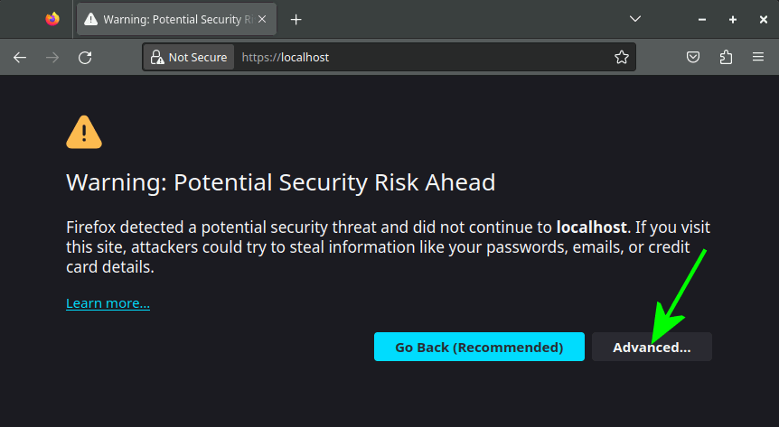

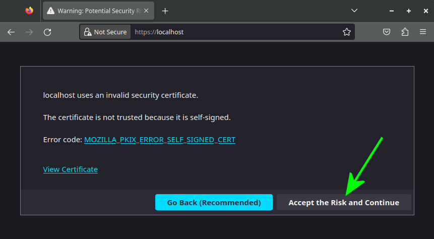

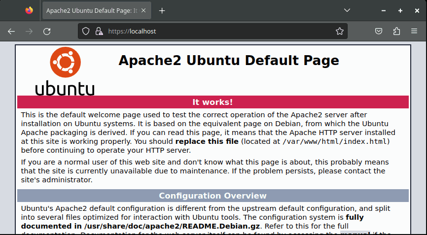


&nbsp;<br />
## Configurando PHP no Apache


&nbsp;<br />
Configure o Apache para usar o PHP via FPM
```sh
sudo a2dismod mpm_prefork
```
```sh
sudo a2enmod mpm_event proxy_fcgi setenvif
```
```sh
sudo systemctl restart apache2.service
```

&nbsp;<br />
Garanta que ambas as versões do PHP estão ativas:
```sh
sudo systemctl start php7.4-fpm.service && systemctl status php7.4-fpm.service
```
```sh
sudo systemctl start php8.0-fpm.service && systemctl status php8.0-fpm.service
```

&nbsp;<br />
Altere os arquivos de configuração para que o Apache reconheça o PHP
```sh
sudo editor /etc/apache2/sites-available/localhost_php7.4.conf
```
Insira o seguinte conteúdo:

```
<VirtualHost 127.0.0.1:80>
	ServerName localhost
	Redirect permanent / https://localhost/
</VirtualHost>
<VirtualHost 127.0.0.1:443>
	ServerName localhost
	DocumentRoot /home/ma/public_html/localhost
	ServerAdmin webmaster@localhost
	ErrorLog ${APACHE_LOG_DIR}/error.log
	CustomLog ${APACHE_LOG_DIR}/access.log combined
	SSLEngine on
	SSLCertificateFile /etc/ssl/certs/localhost-selfsigned.crt
	SSLCertificateKeyFile /etc/ssl/private/localhost-selfsigned.key
	Include /etc/apache2/conf-available/php7.4-fpm.conf
</VirtualHost>
```
**IMPORTANTE!**: Não esqueça de trocar **ma** pelo seu usuário!

&nbsp;<br />
Use o arquivo acima como template para criar o arquivo de configuracao do site para o php 8.0
```sh
sudo cp /etc/apache2/sites-available/localhost_php7.4.conf /etc/apache2/sites-available/localhost_php8.0.conf
```
```sh
sudo sed -i -E 's/7.4/8.0/' /etc/apache2/sites-available/localhost_php8.0.conf
```
&nbsp;<br />
Confira a alteracao para 8.0
```sh
grep -wns 'conf-available.*' /etc/apache2/sites-available/localhost_php8.0.conf
```
&nbsp;<br />
Para fazer o Apache chavear entre o PHP7 e o PHP8 utilize estes dois comandos e teste logo em seguida acessando https://localhost/phpinfo
```sh
sudo ln -sf /etc/apache2/sites-available/localhost_php7.4.conf /etc/apache2/sites-enabled/localhost.conf && sudo systemctl restart apache2.service
```
```sh
sudo ln -sf /etc/apache2/sites-available/localhost_php8.0.conf /etc/apache2/sites-enabled/localhost.conf && sudo systemctl restart apache2.service
```

&nbsp;<br />
Você deverá ver uma tela assim na versao PHP7.4 e algo semelhante para o PHP8.0:

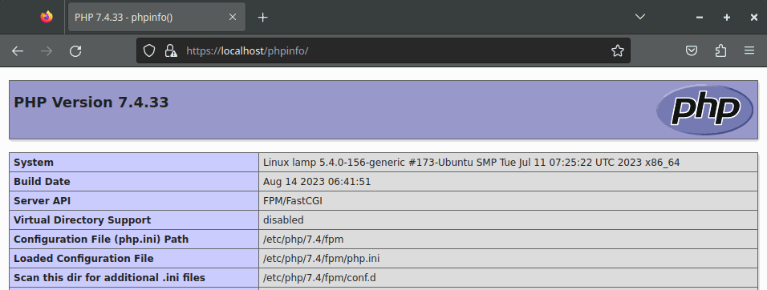

&nbsp;<br />
Agora que seu Apache funciona com HTTPS, PHP7 e PHP8, vamos stopar o serviço e desabilitar o start automático para que não entre em conflito com o NGINX.
```sh
sudo systemctl disable --now apache2.service
```


&nbsp;<br />
# NGINX


&nbsp;<br />
### Instalando o NGINX


&nbsp;<br />
Instale o Nginx:
```sh
sudo apt install nginx
```

&nbsp;<br />
Teste se o servidor web está no ar:
```sh
curl -s -I localhost
```
O retorno do comando acima deverá ser parecido com este:
```
HTTP/1.1 200 OK
Server: nginx/1.18.0 (Ubuntu)
Date: Sat, 26 Aug 2023 01:50:12 GMT
Content-Type: text/html
Content-Length: 10918
Last-Modified: Fri, 25 Aug 2023 20:32:02 GMT
Connection: keep-alive
ETag: "64e90fc2-2aa6"
Accept-Ranges: bytes
```


&nbsp;<br />
## Configurando PHP no NGINX


&nbsp;<br />
Edite o arquivo de configuração do NGINX
&nbsp;<br />
```sh
sudo editor /etc/nginx/nginx.conf
```
Insira as linhas abaixo dentro da diretiva "http {...}"
```
evite erro 504 ao depurar php
fastcgi_connect_timeout 75;
fastcgi_send_timeout 3600;
fastcgi_read_timeout 3600;
client_max_body_size 100M;
```

&nbsp;<br />
Crie os arquivos de configuração para o domínio localhost
```sh
sudo editor /etc/nginx/sites-available/localhost_php7.4
```
Insira o seguinte conteúdo:
```
server {
    listen 80;
    server_name localhost;
    root /home/ma/public_html/localhost;
    index index.php index.html index.htm;
    location / {
        try_files $uri $uri/ /index.php$is_args$args;
    }
    location ~ \.php$ {
        include snippets/fastcgi-php.conf;
        fastcgi_pass unix:/run/php/php7.4-fpm.sock;
    }
}
```
**IMPORTANTE!**: Não esqueça de trocar **ma** pelo seu usuário!

&nbsp;<br />
Utilize o arquivo acima como template, apenas alterando a versão do PHP:
```sh
sudo cp /etc/nginx/sites-available/localhost_php7.4 /etc/nginx/sites-available/localhost_php8.0
```
```sh
sudo sed -i -E 's/7\.4/8.0/' /etc/nginx/sites-available/localhost_php8.0
```

Confira a alteração:
```sh
grep -wns 'fastcgi_pass.*' /etc/nginx/sites-available/localhost_php8.0 -A 0
```

&nbsp;<br />
Desative o site default. Ele não será mais necessário.
```sh
sudo unlink /etc/nginx/sites-enabled/default
```

&nbsp;<br />
Reinicie o servidor com PHP7 depois com PHP8 usando este dois comandos.
```sh
sudo ln -sf ../sites-available/localhost_php7.4 /etc/nginx/sites-enabled/localhost && sudo systemctl restart nginx.service
```
Abra este dois sites no navegador: http://localhost e http://localhost/phpinfo e verifique se estas páginas estão sendo servidas.

```sh
sudo ln -sf ../sites-available/localhost_php8.0 /etc/nginx/sites-enabled/localhost && sudo systemctl restart nginx.service
```
Abra este dois sites no navegador: http://localhost e http://localhost/phpinfo e verifique se estas páginas estão sendo servidas.


&nbsp;<br />
## Instalando certificado SSL no NGINX (HTTPS)


&nbsp;<br />
Crie um arquivo DIFFIE-HELLMAN (DH).
```sh
sudo openssl dhparam -out /etc/nginx/dhparam.pem 4096
```
Obs: O processamento deste comando pode levar **vários minutos**.

&nbsp;<br />
Crie um snippet para comportar o atalho para os arquivos do certificado.
```sh
sudo editor /etc/nginx/snippets/localhost-certs.conf
```
Insira este conteúdo:
```
ssl_certificate /etc/ssl/certs/localhost-selfsigned.crt;
ssl_certificate_key /etc/ssl/private/localhost-selfsigned.key;
```
Obs: Note que é o mesmo certificado usado no Apache

&nbsp;<br />
Crie um snippet para o arquivo DIFFIE-HELLMAN
```sh
sudo editor /etc/nginx/snippets/ssl-params.conf
```
Insira o conteúdo abaixo:
```
ssl_protocols TLSv1.3;
ssl_prefer_server_ciphers on;
ssl_dhparam /etc/nginx/dhparam.pem;
ssl_ciphers EECDH+AESGCM:EDH+AESGCM;
ssl_ecdh_curve secp384r1;
ssl_session_timeout 10m;
ssl_session_cache shared:SSL:10m;
ssl_session_tickets off;
ssl_stapling on;
ssl_stapling_verify on;
resolver 8.8.8.8 8.8.4.4 valid=300s;
resolver_timeout 5s;
add_header X-Frame-Options DENY;
add_header X-Content-Type-Options nosniff;
add_header X-XSS-Protection "1; mode=block";
```

&nbsp;<br />
Atualize os arquivos de configuração do dominio localhost, inserindo as configurações para HTTPS
```sh
sudo editor /etc/nginx/sites-available/localhost_php7.4
```
O conteúdo do arquivo passa ser este:
```
server {
	server_name localhost;
	listen 127.0.0.1:443 ssl;
	root /home/ma/public_html/localhost;
	index index.php index.html index.htm;
	location / {
		try_files $uri $uri/ /index.php$is_args$args;
	}
	location ~ \.php$ {
		include snippets/fastcgi-php.conf;
		fastcgi_pass unix:/run/php/php7.4-fpm.sock;
	}
	include snippets/localhost-certs.conf;
	include snippets/ssl-params.conf;
}
server {
	server_name localhost;
	listen 80;
	return 301 https://$server_name$request_uri;
}
```
**IMPORTANTE!**: Não esqueça de trocar **ma** pelo seu usuário!

&nbsp;<br />
Faca o mesmo para o php 8.0
```sh
sudo cp /etc/nginx/sites-available/localhost_php7.4 /etc/nginx/sites-available/localhost_php8.0
```
```sh
sudo sed -i -E 's/7\.4/8.0/' /etc/nginx/sites-available/localhost_php8.0
```
Confira a alteracao
```sh
grep -wns 'fastcgi_pass.*' /etc/nginx/sites-available/localhost_php8.0 -A 0
```
Obs: O parâmetro -A 0 define a quantidade de linhas apresentadas após o match do regex 'fastcgi_pass.*'

&nbsp;<br />
Reinicie o servidor com PHP7 depois com PHP8 usando este dois comandos.
```sh
sudo ln -sf /etc/nginx/sites-available/localhost_php7.4 /etc/nginx/sites-enabled/localhost && sudo systemctl restart nginx.service
```
Para verificar que a página php está funcionando via https, abra o endereço https://localhost/phpinfo no navegador.

```sh
sudo ln -sf /etc/nginx/sites-available/localhost_php8.0 /etc/nginx/sites-enabled/localhost && sudo systemctl restart nginx.service
```
Abra novamente https://localhost/phpinfo e verifique que agora o NGINX está chamando o PHP 8.0

&nbsp;<br />
Tudo certo com a configuração do NGINX. Desabilite a inicialização automática e pare o serviço:
```sh
sudo systemctl disable --now nginx.service
```


&nbsp;<br />
# XDEBUG


&nbsp;<br />
Instale o xdebug
```sh
sudo apt install php7.4-xdebug php8.0-xdebug
```


&nbsp;<br />
## Configurando o XDEBUG


&nbsp;<br />
Edite o arquivo de configurações do XDEBUG para as versões 7 e 8 do PHP
```sh
sudo editor /etc/php/7.4/mods-available/xdebug.ini
```
O arquivo deverá ficar com este conteúdo:
```
zend_extension=xdebug.so
xdebug.mode=debug
xdebug.start_with_request=yes
xdebug.idekey=VSCODE
xdebug.client_port=9003
xdebug.var_display_max_depth=5
xdebug.log_level=0
```
Obs: log_level é desabilitado para não criar entradas

&nbsp;<br />
Basta copiar as mesmas configurações para o PHP8.0:
```sh
sudo cp /etc/php/7.4/mods-available/xdebug.ini /etc/php/8.0/mods-available/xdebug.ini
```


&nbsp;<br />
## Testando a instalação do XDEBUG


&nbsp;<br />
Inicie o NGINX com o PHP7.4. Para isso, execute estes comandos para Parar, Trocar a versão do PHP e configurar o NGINX:
```sh
sudo systemctl stop nginx.service && sudo systemctl stop php7.4-fpm.service
```
Mude a versão do executável do php para que debugger encontre o executável correto.
```sh
sudo update-alternatives --set php /usr/bin/php7.4
```
Faça o NGINX ler as configurações do PHP 7.4 alterando o caminho do symlink. Inicie os serviços NGINX e o PHP
```sh
sudo ln -sf /etc/nginx/sites-available/localhost_php7.4 /etc/nginx/sites-enabled/localhost && sudo systemctl start php7.4-fpm.service && sudo systemctl start nginx.service
```

&nbsp;<br />
Abra a página https://localhost/phpinfo no navegador. Role a tela até aparecer as configurações do XDEBUG desta forma:

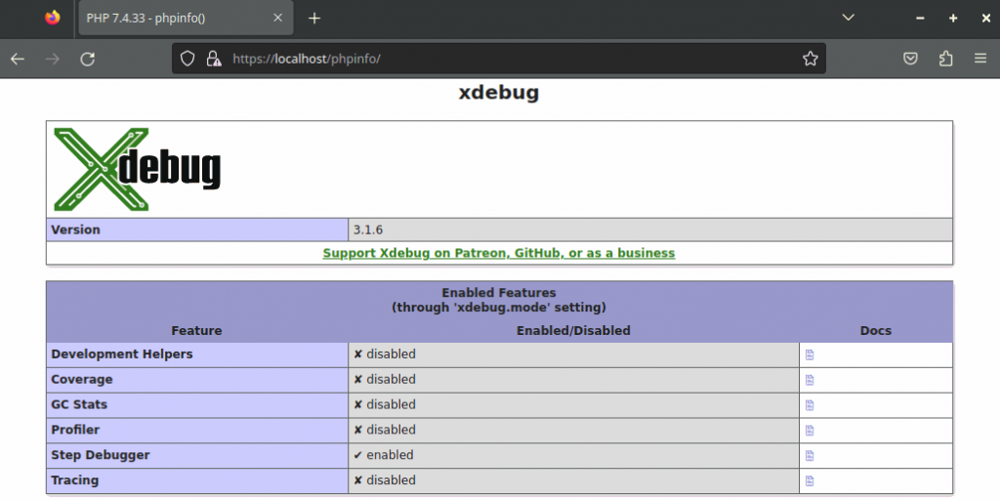

Procure pela string "VSCODE" nesta página. Ela precisa estar presente.

Repita [este passo](#testando-a-instalação-do-xdebug) trocando 7.4 por 8.0


&nbsp;<br />
# VSCODE


&nbsp;<br />
Acesse: https://code.visualstudio.com/Download

&nbsp;<br />
Baixe o instalador depois execute a instalação com este comando:
```sh
sudo apt install ~/Downloads/code_1.81.1-1691620686_amd64.deb
```
Obs: Altere o nome do arquivo para a versão que baixou.


&nbsp;<br />
## Configurando o debugger do VSCODE


&nbsp;<br />
Execute o Visual Studo Code e instale a extension **PHP Debug**
```sh
View > Extensions > Procure por "PHP Debug" na caixa de procura
```


&nbsp;<br />
Clique em **Install**, depois vá em Extension Settings

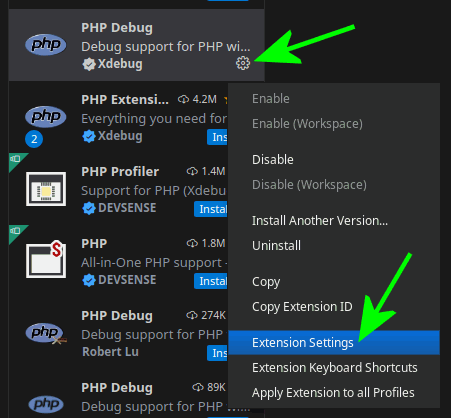

&nbsp;<br />
Depois clique em **Edit in settings.json**

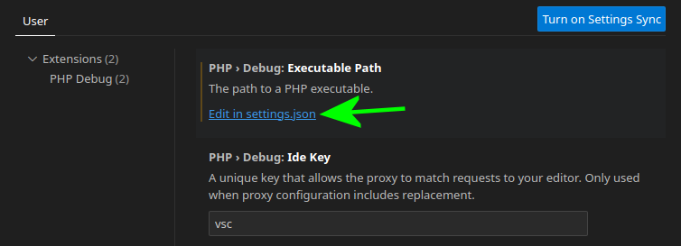

&nbsp;<br />
Insira as configurações abaixo e salve o arquivo

```
"php.debug.executablePath": "/usr/bin/php",
"php.debug.ideKey": "VSCODE"
```


&nbsp;<br />
## Preparando o index.php


&nbsp;<br />
Vamos fazer nossa primeira edição no código fonte do site pelo VSCODE.

Abra o arquivo:
File > Open Folder > ~/public_html Clique em "Yes, I thrust the authors", depois abra o arquivo phpinfo/index.php.

Edite-o de forma que ele fique assim:
```php
<?php
echo "hello world!";
phpinfo();
?>
```


&nbsp;<br />
## Iniciando o primeiro debug


&nbsp;<br />
Uma vez que o XDEBUG está ativo, e o navegador está na página a ser depurada, o VSCODE precisa reconhecer o XDEBUG.

Obs: Esta parte é um pouco "chata" porque as vezes o VSCODE não reconhece o XDEBUG de imediato. Pode ser necessário reabrir o VSCODE e recarregar a página no navegador para que o VSCODE reconheça o XDEBUG através da porta 9003.

Quando o VSCODE reconhecer o XDEBUG a opção **Listen for Xdebug** ficará ativa e deve estar selecionada.

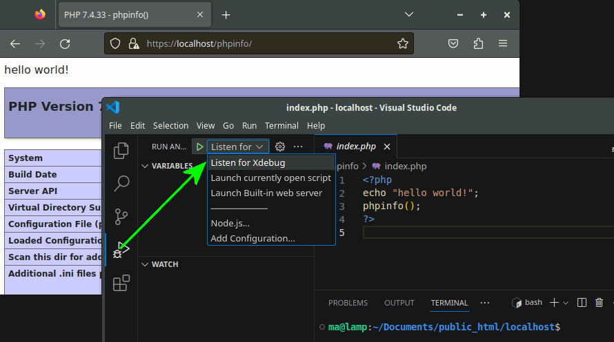

&nbsp;<br />
Está quase tudo pronto, agora basta teclar F5 (Start Debugging) no VSCODE para iniciar a escuta, quando isso ocorrer, uma barra azul aparecerá no rodapé do VSCODE:

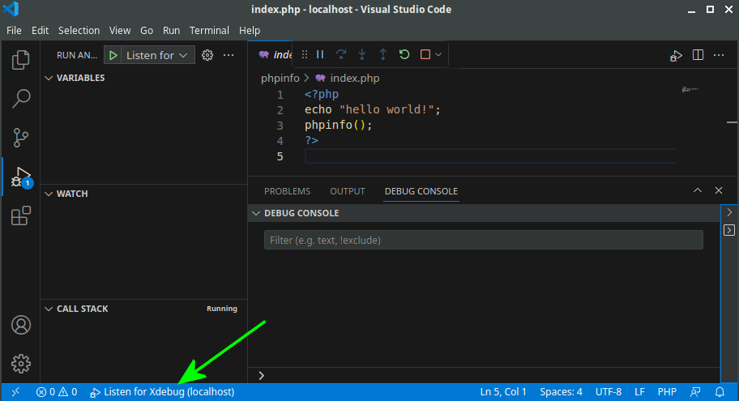

&nbsp;<br />
Tudo pronto! Para iniciar a depuração, basta setar um breakpoint na linha desejada (F9) e recarregar a página no navegador:

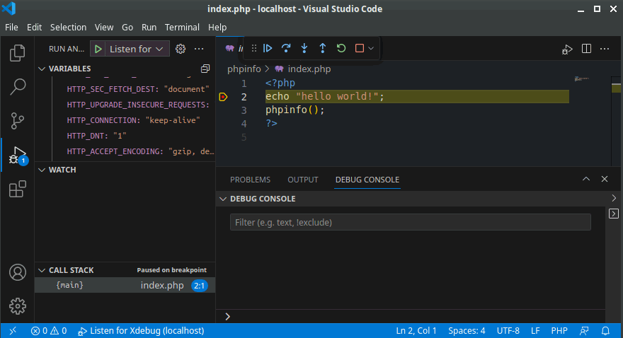

Obs: Não é mais necessário instalar plugins do tipo "Xdebug helper" no browser. Tudo é controlado pelo VSCODE.

&nbsp;<br />
Inicie o NGINX com o PHP8.0 agora. Para isso, execute estes comandos:
```sh
sudo systemctl stop nginx.service && sudo systemctl stop php8.0-fpm.service
```
```sh
sudo update-alternatives --set php /usr/bin/php8.0
```
```sh
sudo ln -sf /etc/nginx/sites-available/localhost_php8.0 /etc/nginx/sites-enabled/localhost && sudo systemctl start php8.0-fpm.service && sudo systemctl start nginx.service
```
Agora Teste o debugger com o PHP8.0 e a configuração estará completa.


&nbsp;<br />
## Utilizando o plugin Live Server com PHP

O plugin "Live Server" do VSCODE cria um servidor local, permitindo que páginas web sejam recarregadas automaticamente quando um arquivo é salvo. No entanto, ele só funciona com páginas estáticas.

Para fazer ele funcionar com PHP, é necessário instalar um plugin no navegador que converte o endereço do Live Server para o endereço do servidor de desenvolvimento PHP.

O plugin se chama "Live Server Web Extension". Existem versões tanto para o Firefox quanto para o Chrome.

Configure desta forma:

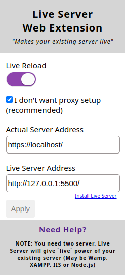

Pronto, o navegador estará sincronizado com seu projeto e fará o recarregamento da página toda vez que algum arquivo do projeto for modificado.


&nbsp;<br />
# lampconfig.sh


&nbsp;<br />
Esse é o script que vai orquestrar tudo o que foi instalado aqui, subindo seletivamente os serviços de acordo com o parametro recebido:

Baixe o arquivo **lampconfig.sh** para `/home/ma`

Conceda permissão de execução:
```sh
chown ma:ma /home/ma/lampconfig.sh && sudo chmod 750 /home/ma/lampconfig.sh
```
Obs: Lembrando mais uma vez que você deve trocar **ma** pelo seu usuário.

&nbsp;<br />
Para subir a stack desejada, siga a sintaxe do comando abaixo:
```sh
sudo ~/lampconfig.sh "apache php7 mysql5 xdebugoff"
```
É possível quaisquer combinações destes 4 elementos:
- **apache** ou **nginx**
- **php7** ou **php8**
- **mysql5** opu **mysql8**
- **xdebugon** ou **xdebugoff** (quando omitido, assume-se **xdebugon**)

&nbsp;<br />
Para desligar todos os serviços, use o parâmetro "turnoffall"
```sh
sudo ~/lampconfig.sh "turnoffall"
```
Ao desligar os serviços, todos os sites diferentes de "localhost" que apontam para 127.0.0.1 serão comentados no arquivo /etc/hosts


&nbsp;<br />
# Criando um novo domínio 'teste.dev.br'


&nbsp;<br />
Em uma situação real, será necessário que o servidor de desenvolvimento utilize o mesmo endereço do servidor de produção, então vamos configurar o ambiente para servir um domínio fictício chamado **teste.dev.br**.


&nbsp;<br />
## Certificado teste.dev.br:


Crie um certificado self-signed para o dominio **teste.dev.br**
```sh
sudo openssl req -x509 -nodes -days 3650 -newkey rsa:2048 -keyout /etc/ssl/private/teste.dev.br-selfsigned.key -out /etc/ssl/certs/teste.dev.br-selfsigned.crt
```
&nbsp;<br />
Ao executar o comando acima, serão solicitadas algumas informações, como Country, State, etc. A **única informação realmente importante** é "Common Name (e.g. server FQDN or YOUR name)". Aqui você deve digitar EXATAMENTE o dominio para o qual deseja habilitar o certificado, neste caso **teste.dev.br**. Sugestão de preenchimento:
```
Country Name (2 letter code) [AU]: BR
State or Province Name (full name) [Some-State]: SP
Locality Name (eg, city) []: SP
Organization Name (eg, company) [Internet Widgits Pty Ltd]: ACME
Organizational Unit Name (eg, section) []: ACME
Common Name (e.g. server FQDN or YOUR name) []: teste.dev.br
Email Address []: webmaster@teste.dev.br
```


&nbsp;<br />
## index.php teste.dev.br:


Crie uma nova pasta de publicação e o arquivo de teste:
```sh
mkdir ~/public_html/teste.dev.br
```
```sh
echo '<?php phpinfo(); ?>' > ~/public_html/teste.dev.br/index.php
```


&nbsp;<br />
## Apache teste.dev.br:


Crie os arquivos de configuração:
```sh
sudo editor /etc/apache2/sites-available/teste.dev.br_php7.4.conf
```
Insira o seguinte conteúdo:

```
<VirtualHost 127.0.0.1:80>
	ServerName teste.dev.br
	Redirect permanent / https://teste.dev.br/
</VirtualHost>
<VirtualHost 127.0.0.1:443>
	ServerName teste.dev.br
	DocumentRoot /home/ma/public_html/teste.dev.br
	ServerAdmin webmaster@teste.dev.br
	ErrorLog ${APACHE_LOG_DIR}/error.log
	CustomLog ${APACHE_LOG_DIR}/access.log combined
	SSLEngine on
	SSLCertificateFile /etc/ssl/certs/teste.dev.br-selfsigned.crt
	SSLCertificateKeyFile /etc/ssl/private/teste.dev.br-selfsigned.key
	Include /etc/apache2/conf-available/php7.4-fpm.conf
</VirtualHost>
```
**IMPORTANTE!**: Não esqueça de trocar **ma** pelo seu usuário!

&nbsp;<br />
Use o arquivo acima como template para criar o arquivo de configuracao do site para o php 8.0
```sh
sudo cp /etc/apache2/sites-available/teste.dev.br_php7.4.conf /etc/apache2/sites-available/teste.dev.br_php8.0.conf
```
```sh
sudo sed -i -E 's/7.4/8.0/' /etc/apache2/sites-available/teste.dev.br_php8.0.conf
```


&nbsp;<br />
## NGINX teste.dev.br:


Crie um snippet para comportar o atalho para os arquivos do certificado.
```sh
sudo editor /etc/nginx/snippets/teste.dev.br-certs.conf
```
Insira este conteúdo:
```
ssl_certificate /etc/ssl/certs/teste.dev.br-selfsigned.crt;
ssl_certificate_key /etc/ssl/private/teste.dev.br-selfsigned.key;
```

&nbsp;<br />
Atualize os arquivos de configuração do dominio teste.dev.br:
```sh
sudo editor /etc/nginx/sites-available/teste.dev.br_php7.4
```
Insira este conteúdo:
```
server {
	server_name teste.dev.br;
	listen 127.0.0.1:443 ssl;
	root /home/ma/public_html/teste.dev.br;
	index index.php index.html index.htm;
	location / {
		try_files $uri $uri/ /index.php$is_args$args;
	}
	location ~ \.php$ {
		include snippets/fastcgi-php.conf;
		fastcgi_pass unix:/run/php/php7.4-fpm.sock;
	}
	include snippets/teste.dev.br-certs.conf;
	include snippets/ssl-params.conf;
}
server {
	server_name teste.dev.br;
	listen 80;
	return 301 https://$server_name$request_uri;
}
```
**IMPORTANTE!**: Não esqueça de trocar **ma** pelo seu usuário!


Faca o mesmo para o php 8.0
```sh
sudo cp /etc/nginx/sites-available/teste.dev.br_php7.4 /etc/nginx/sites-available/teste.dev.br_php8.0
```
```sh
sudo sed -i -E 's/7\.4/8.0/' /etc/nginx/sites-available/teste.dev.br_php8.0
```


&nbsp;<br />
## lampconfig.sh teste.dev.br


Edite o arquivo lampconfig.sh
```sh
editor ~/lampconfig.sh
```
Na linha 4, adicione o domínio na variavel **servername**:
```
servernames="localhost teste.dev.br"
```

&nbsp;<br />
## /etc/hosts teste.dev.br


O script **lampconfig.sh** faz os ajustes necessarios, inserindo, comentando e descomentando entradas de acordo com com a lista da linha 4: **servername**


&nbsp;<br />
## Startando a stack desejada, exemplo:


```sh
sudo ~/lampconfig.sh "nginx php7 mysql5"
```

Mensagens de retorno:
```
Choosen services: nginx php7.4-fpm mysql5.7
Stopping apache2
Stopping nginx
Stopping php7.4-fpm
Stopping php8.0-fpm
Stopping mysql5.7
Stopping mysql8.0
Enabling site [localhost] for [nginx]/[php7.4].
Enabling site [teste.dev.br] for [nginx]/[php7.4].
xdebug 7.4 OFF
xdebug 8.0 OFF
[php7.4] Started
[nginx] Started
[mysql5.7] Started

################## /etc/hosts: relevant lines ##################
127.0.0.1	localhost
127.0.0.1	teste.dev.br
################################################################
```


&nbsp;<br />
# Desabilitando teste.dev.br:


Edite o arquivo lampconfig.sh
```sh
editor ~/lampconfig.sh
```
Na linha 4, remova o domínio na variavel **servername**:
```
servernames="localhost"
```

Aplique as configurações, subindo uma stack, como no exemplo:
```sh
sudo ~/lampconfig.sh "apache php7 mysql5"
```

Para criar outros domínios, o processo é análogo a este.
